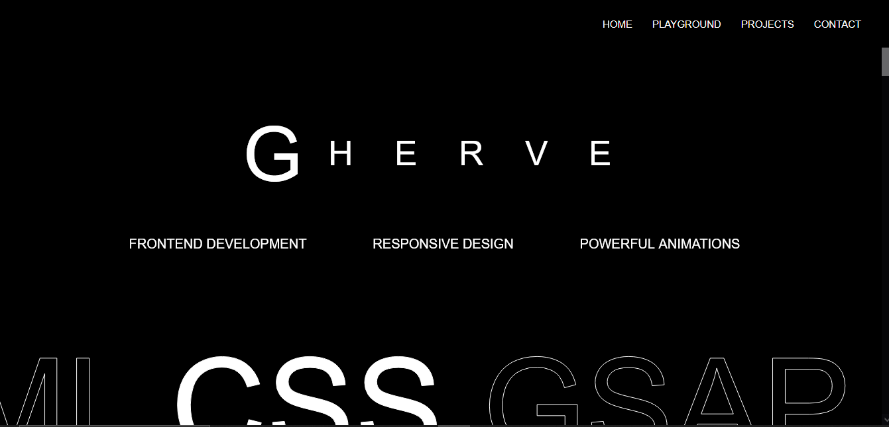

# Interactive Frontend Playground 🎨

An experimental frontend project showcasing **smooth animations** and **interactive elements** built with HTML, CSS, JavaScript, and GSAP.  
The project includes a dedicated **Playground Page** to test, tweak, and explore creative UI effects.

---

## 📸 Preview

  
*(Replace this with your actual screenshot file name if different)*

---

## 🚀 Features
- Custom animations using **GSAP** (GreenSock Animation Platform)
- Interactive buttons, hover effects, and transitions
- Responsive layout for different screen sizes
- Modular structure for easy experimentation

---

## 🛠 Tech Stack
- **HTML5** – Structure and markup  
- **CSS3** – Styling and responsiveness  
- **JavaScript (Vanilla)** – Interactivity and logic  
- **GSAP** – Advanced animations

---

## 📂 Project Structure
```
index.html          # Main homepage
playground.html     # Interactive playground for animations
README.md           # Project documentation
assets/             # Images, styles, and scripts (if applicable)
```

---

## 📦 Installation & Usage

### 1️⃣ Clone the Repository
```bash
git clone https://github.com/<your-username>/<repo-name>.git
```

### 2️⃣ Open the Project
Simply open `index.html` in your browser to view the main page.  
Open `playground.html` to test animations and interactions.

---

## 💡 How It Works
- **index.html** serves as the main landing page with basic animations and interactive elements.
- **playground.html** is a testing ground for experimenting with GSAP animations, hover effects, and layout ideas.
- The design is responsive and works across different screen sizes.

---

## 📜 License
This project is open-source and available under the [MIT License](LICENSE).

---

## 🤝 Contributing
Contributions, ideas, and suggestions are welcome! Feel free to fork this repository and submit a pull request.
